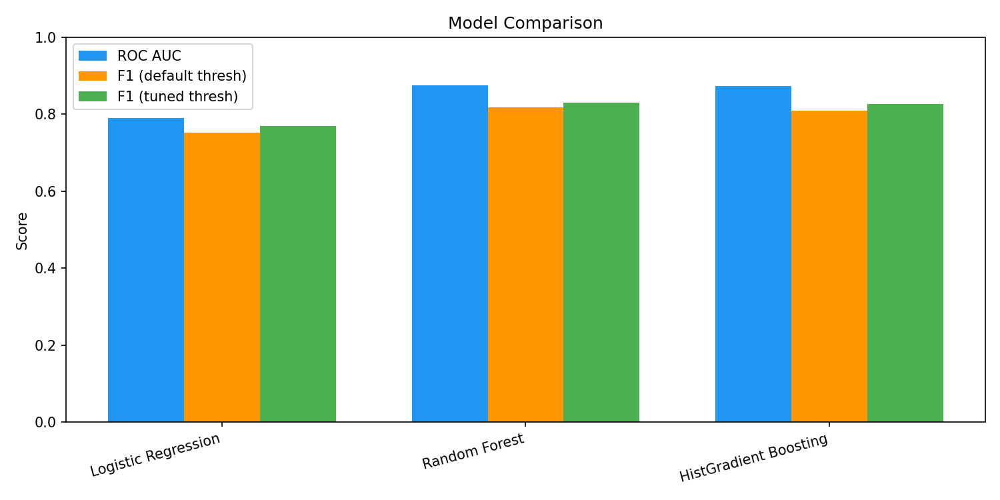
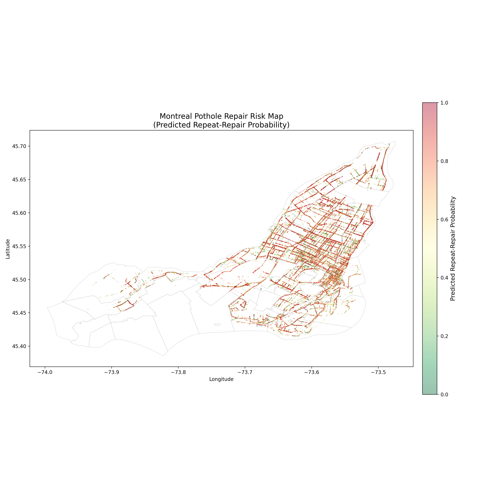

# Montreal Pothole Repair Failure Prediction

Predicting which pothole repairs in Montreal will need to be re-repaired within 6 months, using machine learning on municipal open data.

## Problem

Montreal performs hundreds of thousands of pothole repairs each year. A significant portion of these repairs fail and need to be redone within months — wasting crew time, materials, and causing repeated traffic disruptions. This project builds a predictive model to identify which repairs are most likely to fail, enabling the city to allocate preventive resources more effectively.

A repair is classified as a **repeat failure** if another repair occurs within **10 meters** and **180 days** of the original.

## Results

| Model | ROC AUC | F1 (tuned) | Recall | Precision | Threshold |
|---|---|---|---|---|---|
| Random Forest | **0.876** | **0.831** | 0.921 | 0.757 | 0.637 |
| HistGradient Boosting | 0.874 | 0.828 | 0.901 | 0.765 | 0.361 |
| Logistic Regression | 0.791 | 0.770 | 0.879 | 0.685 | 0.657 |

The best model (Random Forest, cost-sensitive with 3:1 FN/FP weighting) achieves **92% recall** at the tuned threshold — catching 92 out of 100 repairs that will fail — with 76% precision.



### Feature Importance

The top predictive features span multiple categories, with no single group dominating:

- **Weather conditions** — temperature at repair time, rolling precipitation and freeze-thaw cycles
- **Temporal patterns** — repair year, month, and day-of-week effects
- **Road infrastructure** — road age, years since last resurfacing, pavement material
- **Road condition scores** — PCI/IRI indices with temporal matching and staleness tracking
- **Traffic volume** — average daily vehicle counts from nearby intersections

### Risk Mapping

The model produces spatial risk predictions at both the individual repair level and aggregated by arrondissement. Anjou, Montréal-Est, and Montréal-Nord show the highest predicted failure rates, while Westmount and Verdun show the lowest.



## Data Sources

All data is publicly available from Montreal Open Data and Environment Canada:

| Dataset | Source | Records |
|---|---|---|
| Pothole Repairs (2016–2025) | [Montreal Open Data](https://donnees.montreal.ca/dataset/refection-de-chaussee-par-remplissage-mecanise-de-nid-de-poule) | ~790K (after dedup) |
| Road Infrastructure | [Montreal Open Data](https://donnees.montreal.ca/dataset/voirie-actif) | ~57K segments |
| Road Condition (PCI/IRI) | [Montreal Open Data](https://donnees.montreal.ca/dataset/condition-chaussees-reseau-routier) | ~47K (2020–2024) |
| Road Network (Geobase) | [Montreal Open Data](https://donnees.montreal.ca/dataset/geobase) | — |
| Arrondissement Boundaries | [Montreal Open Data](https://donnees.montreal.ca/dataset/limites-administratives-agglomeration) | 34 polygons |
| Daily Weather | [Environment Canada](https://dd.weather.gc.ca/today/climate/observations/daily/csv/QC/) | ~3,700 days |
| Traffic Counts | [Montreal Open Data](https://donnees.montreal.ca/dataset/comptage-vehicules-pietons) | ~2,200 intersections |

## Pipeline

The project is organized as three sequential scripts:

### 1. `data_cleaning.py` — Data Cleaning

Loads raw datasets, standardizes formats, and exports cleaned files.

- Normalizes CRS to EPSG:4326 across all spatial datasets
- Filters potholes to Montreal bounding box, removes 237K same-day/same-location duplicates
- Preserves equipment type (`Appareil`) as a potential feature
- Drops road condition years with no PCI/IRI (2010, 2015, 2018), keeping only 2020+
- Fixes `SnowOnGround` encoding: summer nulls → 0, winter gaps → interpolation
- Computes multi-year traffic averages per intersection for stability
- Pre-computes weather rolling features (30d/60d precipitation, freeze-thaw cycles) and repair-day features

### 2. `feature_engineering.py` — Joins & Feature Engineering

Joins all cleaned datasets onto pothole records and engineers the final feature set.

- **Target labeling**: KD-tree spatial index to find repeat repairs within 10m / 180 days
- **Road assets**: Two-pass spatial join (15m buffer intersection → 50m nearest-neighbor fallback)
- **Road condition**: Potholes → Geobase (for `ID_TRC`) → temporally-matched condition scores (most recent assessment *before* each repair date), with `condition_age_days` staleness feature
- **Traffic**: Nearest-neighbor join capped at 500m (beyond that → NaN, not noisy distant values)
- **Weather**: Exact date merge
- **Engineered features**: `road_age`, `years_since_surface`, `repair_month`, `repair_dow`, `below_zero`, `days_since_freeze_thaw`, `has_condition_score`, `date_unknown`

### 3. `model_training.py` — Model Training & Evaluation

Trains and compares cost-sensitive classifiers with threshold optimization.

- Compares Logistic Regression, Random Forest, and HistGradient Boosting
- Cost-sensitive learning: class 1 (repeat) weighted 3× heavier than class 0
- Threshold tuning via precision-recall curve to maximize F1 on positive class
- HistGradient Boosting receives raw NaN values (native handling); other models use median imputation
- Outputs classification reports, confusion matrices, feature importance, and comparison plots

### 4. `risk_mapping.py` — Risk Visualization

Generates spatial risk maps from model predictions.

- Retrains best model and predicts on full dataset with geometry
- Checks arrondissement-level variation (includes choropleth if std > 0.02)
- **Static**: matplotlib point scatter and arrondissement choropleth (PNG)
- **Interactive**: Folium heatmap, choropleth with tooltips, high-risk point map (HTML)

## Project Structure

```
pothole-prediction/
├── data_cleaning.py            # Step 1: clean raw data
├── feature_engineering.py      # Step 2: spatial joins + features
├── model_training.py           # Step 3: train and evaluate models
├── risk_mapping.py             # Step 4: generate risk maps
├── datasets/
│   ├── pothole_fixes/          # Raw pothole CSVs and GPKGs (2016-2025)
│   ├── road_assets/            # voirie_actif.geojson
│   ├── road_condition/         # Auscultation CSVs (2020, 2022, 2024)
│   ├── road_network/           # Geobase + arrondissement.geojson
│   ├── traffic/                # Traffic counting CSVs
│   ├── weather/                # Environment Canada daily CSVs
│   └── model_results/          # Generated outputs
│       ├── model_summary.csv
│       ├── feature_importance.csv
│       ├── model_comparison.png
│       ├── confusion_matrices.png
│       ├── feature_importance.png
│       ├── risk_map_points.png
│       ├── risk_map_arrondissement.png
│       ├── risk_map_heatmap.html
│       ├── risk_map_arrondissement.html
│       ├── risk_map_high_risk_points.html
│       └── arrondissement_risk_stats.csv
└── README.md
```

## Setup

```bash
pip install pandas geopandas scikit-learn matplotlib scipy folium
```

Run the pipeline in order:

```bash
python data_cleaning.py
python feature_engineering.py
python model_training.py
python risk_mapping.py
```

Raw datasets should be downloaded from the sources listed above and placed in the corresponding `datasets/` subdirectories before running.

## Key Findings

- **Weather at repair time matters most**, but unlike initial models where it dominated at 70%, the improved pipeline distributes importance more evenly across feature categories.
- **Temporal matching of road condition data is critical.** Simply joining the latest PCI/IRI score without considering when the assessment was done relative to the repair produced near-zero signal. Proper temporal matching (most recent assessment before each repair) made these features meaningfully predictive.
- **Data quality > model complexity.** The jump from 0.34 → 0.83 F1 on the positive class came almost entirely from better data cleaning (deduplication, coordinate filtering, SnowOnGround encoding fix, traffic distance caps) rather than from switching algorithms.
- **Cost-sensitive framing is essential.** False negatives (missing a repair that will fail) are ~3× more costly than false positives (flagging a repair that would have held). Threshold tuning from 0.5 → 0.637 pushed recall to 92%.
- **Spatial risk varies meaningfully by neighbourhood.** Anjou and Montréal-Nord show consistently higher predicted failure rates than Westmount and Verdun, suggesting targeted resource allocation could improve outcomes.

## Requirements

- Python 3.9+
- pandas, geopandas, scikit-learn, matplotlib, scipy, numpy
- folium (for interactive maps)
